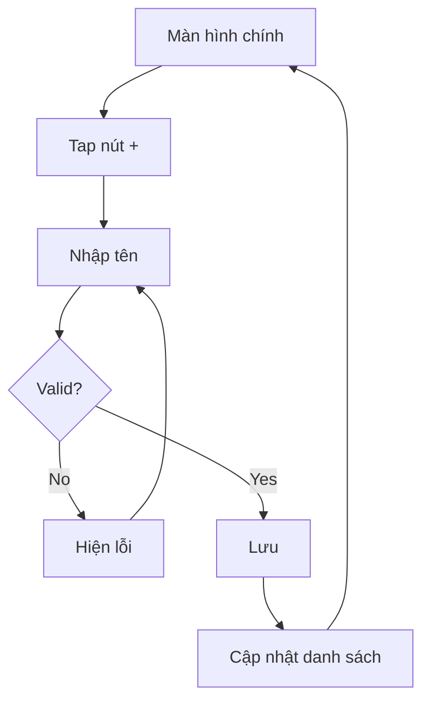

# Hướng Dẫn Sử Dụng Subagent - Tiếng Việt

## 🎯 Tổng Quan Nhanh

Hệ thống có **6 subagents** để tạo tài liệu specification:

1. **write-project-docs** - Điều phối tất cả (orchestrator)
2. **write-project-overview** - Tạo tầm nhìn tổng quan
3. **write-use-cases** - Tạo user stories
4. **write-functional-requirements** - Tạo yêu cầu chi tiết
5. **write-wireframes** - Tạo wireframes UI
6. **write-ux-flows** - Tạo sơ đồ user journey

---

## 🚀 Cách Sử Dụng

### Cách 1: Tạo Tất Cả (Khuyến Nghị)

```
@write-project-docs Tạo tài liệu đầy đủ cho ứng dụng quản lý công việc
```

**Kết quả**: 5 tài liệu hoàn chỉnh trong 30-60 phút

**Quy trình**:
1. Agent hỏi về dự án của bạn
2. Tạo Project_Overview.md → Bạn xem và duyệt
3. Tạo Use_Cases.md → Bạn xem và duyệt
4. Tạo Functional_Requirements.md → Bạn xem và duyệt
5. Tạo Wireframes.md → Bạn xem và duyệt
6. Tạo UX_Flows.md → Bạn xem và duyệt
7. Hoàn thành!

---

### Cách 2: Tạo Từng Tài Liệu

```
@write-project-overview Tạo tổng quan cho app quản lý công việc
@write-use-cases Tạo use cases cho app quản lý công việc
@write-functional-requirements Tạo yêu cầu chức năng cho app quản lý công việc
@write-wireframes Tạo wireframes cho app quản lý công việc
@write-ux-flows Tạo UX flows cho app quản lý công việc
```

**Khi nào dùng**: Khi muốn update từng tài liệu riêng lẻ

---

## 📋 5 Tài Liệu Được Tạo

### 1. Project_Overview.md (Tổng Quan Dự Án)

**Nội dung**:
- Vấn đề cần giải quyết
- Đối tượng người dùng (personas)
- Công nghệ sử dụng (iOS, SwiftUI, etc.)
- Lộ trình phát triển (roadmap)
- Chỉ số thành công

**Ví dụ**:
```markdown
# Todo App - Project Overview

## 1. Problem Statement
Người dùng cần cách đơn giản để quản lý công việc hàng ngày...

## 2. User Personas
- Persona 1: Chuyên gia bận rộn, 25-40 tuổi
- Persona 2: Sinh viên, 18-25 tuổi

## 3. Technology Stack
- iOS 15+, SwiftUI, Core Data
```

---

### 2. Use_Cases.md (Trường Hợp Sử Dụng)

**Nội dung**:
- User stories (UC-001, UC-002, etc.)
- Scenarios (happy path + error cases)
- Ưu tiên (High/Medium/Low)

**Ví dụ**:
```markdown
## UC-001: Tạo Công Việc
**As a** người dùng
**I want** tạo công việc mới
**So that** tôi có thể theo dõi việc cần làm

**Main Flow**:
1. User mở app
2. User tap nút "+"
3. User nhập tên công việc
4. User tap "Save"
5. Công việc được thêm vào danh sách
```

---

### 3. Functional_Requirements.md (Yêu Cầu Chức Năng)

**Nội dung**:
- Functional requirements (FR-001, FR-002, etc.)
- Non-functional requirements (NFR-001, etc.)
- Business rules, validation rules
- Error handling

**Ví dụ**:
```markdown
## FR-001: Tạo Công Việc
**Input**: Tên công việc (string, 1-200 ký tự)
**Processing**: Validate, lưu vào Core Data
**Output**: Công việc mới trong danh sách

**Business Rules**:
- BR-001.1: Tên không được để trống
- BR-001.2: Tên tối đa 200 ký tự

**Error Handling**:
- ERR-001.1: Tên trống → "Vui lòng nhập tên công việc"
```

---

### 4. Wireframes.md (Bản Vẽ Giao Diện)

**Nội dung**:
- ASCII wireframes cho tất cả màn hình
- Design system (màu sắc, font chữ, khoảng cách)
- Common components
- Accessibility

**Ví dụ**:
```markdown
## WF-001: Màn Hình Chính

```
┌─────────────────────────────────────┐
│  [☰]  Công Việc        [🔔] [👤]   │
├─────────────────────────────────────┤
│                                     │
│  Chào buổi sáng, Nam! 👋            │
│                                     │
│  ☐ Mua sữa                    [>]   │
│  ☑ Học SwiftUI                [>]   │
│  ☐ Tập thể dục                [>]   │
│                                     │
│      [+ Thêm Công Việc]             │
│                                     │
└─────────────────────────────────────┘
```
```

---

### 5. UX_Flows.md (Luồng Trải Nghiệm)

**Nội dung**:
- Mermaid diagrams cho user journeys
- Feature flows
- Error handling flows
- Navigation patterns

**Ví dụ**:
```markdown
## Luồng Tạo Công Việc


```

---

## 🔄 Cách Subagents Làm Việc

### Kiến Trúc

```
User
  ↓
@write-project-docs (Orchestrator)
  ↓
  ├─→ @write-project-overview
  │     └─→ Tạo Project_Overview.md
  │
  ├─→ @write-use-cases
  │     └─→ Tạo Use_Cases.md
  │
  ├─→ @write-functional-requirements
  │     └─→ Tạo Functional_Requirements.md
  │
  ├─→ @write-wireframes
  │     └─→ Tạo Wireframes.md
  │
  └─→ @write-ux-flows
        └─→ Tạo UX_Flows.md
```

### Đặc Điểm

1. **Context Isolation**: Mỗi subagent làm việc độc lập
2. **Task Tool**: Giao tiếp qua Task tool
3. **Child Sessions**: Mỗi subagent có session riêng
4. **User Confirmation**: Chờ duyệt sau mỗi bước

---

## 💡 Ví Dụ Thực Tế

### Tạo App Quản Lý Công Việc

```
User: "@write-project-docs Tạo spec cho app quản lý công việc"

Agent: 
🚀 Quy Trình Tạo Specification Đầy Đủ

Sẽ tạo 5 tài liệu:
1. Project_Overview.md
2. Use_Cases.md
3. Functional_Requirements.md
4. Wireframes.md
5. UX_Flows.md

Thời gian: 30-60 phút
Bạn có thể dừng bất cứ lúc nào.

Sẵn sàng bắt đầu?

User: "Có"

Agent: [Gọi write-project-overview]
Hãy cho tôi biết về app của bạn:
1. Vấn đề gì cần giải quyết?
2. Ai sẽ sử dụng?
3. Tính năng chính?

User: 
"App giúp người dùng quản lý công việc hàng ngày.
Đối tượng: Chuyên gia bận rộn, sinh viên.
Tính năng: Tạo task, đánh dấu hoàn thành, set deadline."

Agent: [Tạo Project_Overview.md]
✅ Đã tạo: Project_Overview.md

📋 Tóm tắt:
- User personas: 2
- Core features: 3
- Tech stack: iOS 15+, SwiftUI, Core Data
- Roadmap: 3 phases

🔍 Vui lòng xem lại file

❓ Bạn muốn:
1. ✅ Tiếp tục tạo Use_Cases.md
2. ✏️ Sửa đổi
3. ⏸️ Dừng lại

User: "1"

Agent: [Gọi write-use-cases]
[Đọc Project_Overview.md]
[Tạo Use_Cases.md]

✅ Đã tạo: Use_Cases.md

📋 Tóm tắt:
- User stories: 5
- Scenarios: 8
- Priority: 3 High, 2 Medium

❓ Bạn muốn:
1. ✅ Tiếp tục tạo Functional_Requirements.md
2. ✏️ Sửa đổi
3. ⏸️ Dừng lại

[... tiếp tục cho 3 documents còn lại ...]

Agent: 
🎉 Hoàn Thành!

✅ Đã tạo 5 tài liệu:
1. ✅ Project_Overview.md
2. ✅ Use_Cases.md
3. ✅ Functional_Requirements.md
4. ✅ Wireframes.md
5. ✅ UX_Flows.md

📁 Vị trí: .opencode/specs/todo-app/

🚀 Bước tiếp theo:
1. Bắt đầu implement feature đầu tiên
2. Chia sẻ với team
3. Tạo high-fidelity mockups

Bạn muốn làm gì tiếp theo?
```

---

## ✅ Lợi Ích

### 1. Có Tổ Chức
- Tất cả spec ở một chỗ
- Cấu trúc rõ ràng
- Dễ tìm kiếm

### 2. Truy Vết Được
```
User Persona → User Story → Requirement → Wireframe → UX Flow
```
Mọi thứ đều liên kết với nhau

### 3. Tiết Kiệm Thời Gian
- Không cần viết spec thủ công
- AI tạo tự động
- Chỉ cần review và approve

### 4. Chất Lượng Cao
- Format chuẩn
- Không bỏ sót
- Best practices

### 5. Dễ Cộng Tác
- Team cùng xem
- Dễ feedback
- Version control

---

## 🎓 Tips

### Cho Người Mới

1. **Bắt đầu với project nhỏ**: Todo app, Notes app
2. **Dùng full workflow**: `@create-full-spec`
3. **Đọc kỹ mỗi document**: Hiểu trước khi approve
4. **Đừng ngại sửa**: Request modifications nếu cần

### Cho Người Có Kinh Nghiệm

1. **Tạo từng document**: Linh hoạt hơn
2. **Customize agents**: Thêm project-specific rules
3. **Integrate với tools**: Figma, Jira, etc.
4. **Tạo templates**: Cho các loại project khác nhau

---

## 🔧 Troubleshooting

### Vấn đề: Agent tạo sai nội dung

**Giải pháp**: Cung cấp thông tin chi tiết hơn
```
❌ "Tạo spec cho app của tôi"
✅ "Tạo spec cho app quản lý công việc, giúp người dùng tạo task, set deadline, và theo dõi tiến độ"
```

### Vấn đề: Document quá chung chung

**Giải pháp**: Trả lời câu hỏi của agent chi tiết hơn
```
❌ "Người dùng muốn quản lý việc"
✅ "Người dùng muốn tạo task với tên, mô tả, deadline, priority, và đánh dấu hoàn thành"
```

### Vấn đề: Muốn sửa document đã tạo

**Giải pháp**: Gọi lại agent với yêu cầu sửa
```
@write-use-cases Thêm use case cho social sharing vào todo app
```

---

## 📚 Tài Liệu Liên Quan

- `SUBAGENT_ARCHITECTURE.md` - Kiến trúc chi tiết (English)
- `SPEC_WORKFLOW_GUIDE.md` - Hướng dẫn đầy đủ (English)
- `README.md` - Tổng quan project

---

## 🤝 Hỗ Trợ

Nếu gặp vấn đề:
1. Đọc `SPEC_WORKFLOW_GUIDE.md`
2. Xem examples trong README
3. Kiểm tra logs của subagent
4. Tạo issue trên GitHub

---

**Phiên bản**: 1.0  
**Cập nhật**: 06/02/2026  
**Ngôn ngữ**: Tiếng Việt
