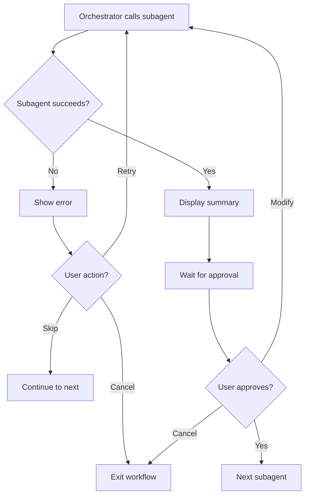
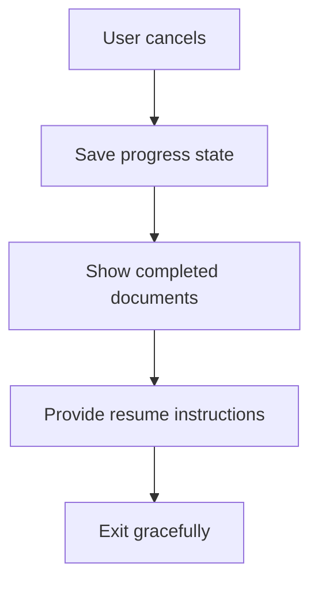

# Subagent Architecture - iOS Spec-Driven Development

## 📋 Tổng Quan

Hệ thống sử dụng kiến trúc **subagent** để tạo tài liệu specification theo cách có tổ chức và có thể truy vết. Mỗi subagent là một chuyên gia độc lập, làm việc trong context riêng và trả kết quả về cho agent chính.

---

## 🏗️ Kiến Trúc Tổng Thể

```
User
  ↓
Primary Agent (Build/Plan)
  ↓
Orchestrator Agent (write-project-docs)
  ↓ [Task Tool]
  ├─→ write-project-overview (Subagent)
  │     ↓ [Child Session]
  │     └─→ Returns: Project_Overview.md summary
  │
  ├─→ write-use-cases (Subagent)
  │     ↓ [Child Session]
  │     └─→ Returns: Use_Cases.md summary
  │
  ├─→ write-functional-requirements (Subagent)
  │     ↓ [Child Session]
  │     └─→ Returns: Functional_Requirements.md summary
  │
  ├─→ write-wireframes (Subagent)
  │     ↓ [Child Session]
  │     └─→ Returns: Wireframes.md summary
  │
  └─→ write-ux-flows (Subagent)
        ↓ [Child Session]
        └─→ Returns: UX_Flows.md summary
```

---

## 🤖 Các Subagent và Vai Trò

### 1. Orchestrator Agent

**Agent**: `write-project-docs`  
**Vai trò**: Điều phối toàn bộ workflow tạo tài liệu dự án  
**Nhiệm vụ**:
- Giới thiệu workflow cho user
- Gọi các subagent theo thứ tự
- Chờ user xác nhận sau mỗi bước
- Quản lý trạng thái workflow
- Hiển thị tổng kết cuối cùng

**Tools**: Read, Write, Task  
**Mode**: Subagent

**Đặc điểm**:
- KHÔNG tự tạo tài liệu
- CHỈ điều phối các subagent khác
- Quản lý user interaction
- Theo dõi tiến độ

---

### 2. Specification Subagents

#### 2.1 write-project-overview

**Vai trò**: Tạo tầm nhìn tổng quan dự án  
**Input**: User answers về problem, users, goals, tech stack  
**Output**: `Project_Overview.md`

**Nội dung tạo**:
- Problem statement & solution
- User personas (2-3 personas)
- Technology stack & architecture
- Development roadmap (3-4 phases)
- Success metrics
- Risks & constraints

**Tools**: Read, Write, WebSearch, WebFetch  
**Dependencies**: None (document đầu tiên)

**Workflow**:
1. Hỏi user về project
2. Research similar apps (nếu cần)
3. Tạo Project_Overview.md
4. Hiển thị summary
5. Chờ user confirmation

---

#### 2.2 write-use-cases

**Vai trò**: Tạo user stories và scenarios  
**Input**: Project_Overview.md  
**Output**: `Use_Cases.md`

**Nội dung tạo**:
- User stories (UC-XXX format)
- Scenarios (happy path + edge cases)
- Priority breakdown (High/Medium/Low)
- User journey maps
- Traceability matrix

**Tools**: Read, Write  
**Dependencies**: Project_Overview.md

**Workflow**:
1. Đọc Project_Overview.md
2. Tạo user stories cho mỗi persona
3. Định nghĩa scenarios
4. Ưu tiên use cases
5. Tạo Use_Cases.md
6. Hiển thị summary
7. Chờ user confirmation

---

#### 2.3 write-functional-requirements

**Vai trò**: Tạo yêu cầu chức năng chi tiết  
**Input**: Project_Overview.md, Use_Cases.md  
**Output**: `Functional_Requirements.md`

**Nội dung tạo**:
- Functional requirements (FR-XXX)
- Non-functional requirements (NFR-XXX)
- Input/output specifications
- Business rules (BR-XXX.Y)
- Validation rules (VR-XXX.Y)
- Error handling (ERR-XXX.Y)
- Acceptance criteria

**Tools**: Read, Write  
**Dependencies**: Project_Overview.md, Use_Cases.md

**Workflow**:
1. Đọc Project_Overview.md và Use_Cases.md
2. Tạo FR cho mỗi use case
3. Định nghĩa NFR (Performance, Security, Usability, etc.)
4. Thêm business rules và validation
5. Tạo Functional_Requirements.md
6. Hiển thị summary
7. Chờ user confirmation

---

#### 2.4 write-wireframes

**Vai trò**: Tạo wireframes và design system  
**Input**: All previous documents  
**Output**: `Wireframes.md`

**Nội dung tạo**:
- ASCII wireframes cho tất cả screens
- Screen inventory (WF-XXX)
- Design system (colors, typography, spacing)
- Common components
- Responsive design rules
- Accessibility requirements
- Dark mode support

**Tools**: Read, Write, WebSearch, WebFetch  
**Dependencies**: Project_Overview.md, Use_Cases.md, Functional_Requirements.md

**Workflow**:
1. Đọc tất cả documents trước đó
2. Tạo wireframes cho mỗi screen
3. Định nghĩa design system
4. Tạo common components
5. Tạo Wireframes.md
6. Hiển thị summary
7. Chờ user confirmation

---

#### 2.5 write-ux-flows

**Vai trò**: Tạo user journey diagrams  
**Input**: All previous documents  
**Output**: `UX_Flows.md`

**Nội dung tạo**:
- Mermaid flow diagrams
- User journeys (new user, returning user)
- Feature flows
- Error handling flows
- Navigation patterns
- Loading states
- Offline support flows

**Tools**: Read, Write  
**Dependencies**: All previous documents

**Workflow**:
1. Đọc tất cả documents
2. Tạo high-level user journeys
3. Tạo detailed feature flows
4. Thêm error handling flows
5. Tạo UX_Flows.md
6. Hiển thị summary
7. Chờ user confirmation
8. Hiển thị completion summary (document cuối cùng)

---

## 🔄 Cơ Chế Giao Tiếp

### Task Tool

Subagents giao tiếp qua **Task tool**:

```typescript
// Orchestrator gọi subagent
await task({
  agent: "write-project-overview",
  instruction: "Create Project_Overview.md for fitness app"
})
```

**Quy trình**:
1. **Task tool tạo child session** cho subagent
2. **Subagent thực thi** trong context riêng
3. **Subagent trả về**:
   - Summary của tất cả tool calls
   - Text response cuối cùng
4. **Orchestrator nhận kết quả** và tiếp tục

### Context Isolation

Mỗi subagent có:
- **Riêng context store**: Không bị nhiễm context từ subagent khác
- **Riêng tool access**: Chỉ dùng tools được phép
- **Riêng session**: Child session độc lập

**Lợi ích**:
- Tránh "cross-task pollution"
- Tiết kiệm context cho primary agent
- Dễ debug và maintain
- Có thể chạy song song (nếu cần)

---

## 📊 Traceability Chain

Mỗi document link với nhau tạo thành chuỗi truy vết:

```
Project_Overview.md
  └─ User Persona: "Busy Professional"
      └─ Use_Cases.md
          └─ UC-001: Create Task
              └─ Functional_Requirements.md
                  └─ FR-001: Task Creation
                      └─ Wireframes.md
                          └─ WF-003: Create Task Screen
                              └─ UX_Flows.md
                                  └─ Flow: Task Creation Journey
```

**Validation**:
- Mỗi use case phải có functional requirement
- Mỗi functional requirement phải có wireframe
- Mỗi wireframe phải có UX flow
- Tất cả trace về user persona

---

## 🎯 Workflow Execution

### Full Workflow Example

```
User: "@write-project-docs Create complete documentation for Todo app"

┌─────────────────────────────────────────┐
│ Orchestrator (write-project-docs)      │
├─────────────────────────────────────────┤
│ 1. Show introduction                    │
│ 2. Wait for user confirmation           │
└─────────────────────────────────────────┘
                ↓
┌─────────────────────────────────────────┐
│ Task Tool → write-project-overview      │
├─────────────────────────────────────────┤
│ Child Session:                          │
│ - Ask user questions                    │
│ - Create Project_Overview.md            │
│ - Return summary                        │
└─────────────────────────────────────────┘
                ↓
┌─────────────────────────────────────────┐
│ Orchestrator                            │
├─────────────────────────────────────────┤
│ - Display summary                       │
│ - Wait for user approval                │
└─────────────────────────────────────────┘
                ↓
┌─────────────────────────────────────────┐
│ Task Tool → write-use-cases             │
├─────────────────────────────────────────┤
│ Child Session:                          │
│ - Read Project_Overview.md              │
│ - Create Use_Cases.md                   │
│ - Return summary                        │
└─────────────────────────────────────────┘
                ↓
┌─────────────────────────────────────────┐
│ Orchestrator                            │
├─────────────────────────────────────────┤
│ - Display summary                       │
│ - Wait for user approval                │
└─────────────────────────────────────────┘
                ↓
        [Repeat for remaining 3 documents]
                ↓
┌─────────────────────────────────────────┐
│ Orchestrator                            │
├─────────────────────────────────────────┤
│ - Show completion summary               │
│ - List all created documents            │
│ - Suggest next steps                    │
└─────────────────────────────────────────┘
```

---

## 🔧 Error Handling

### Subagent Failures



### User Cancellation



---

## 💡 Best Practices

### For Orchestrator Agent

✅ **Do**:
- Use Task tool to invoke subagents
- Wait for user confirmation between steps
- Show clear progress indicators
- Handle errors gracefully
- Save state for resuming

❌ **Don't**:
- Create documents directly
- Skip user confirmations
- Continue after errors without user input
- Lose progress state

### For Subagents

✅ **Do**:
- Read dependencies first
- Create only assigned document
- Return clear summary
- Ask user confirmation
- Handle validation errors

❌ **Don't**:
- Create multiple documents
- Continue without approval
- Skip reading dependencies
- Assume user intent

---

## 📈 Performance Considerations

### Sequential Execution

Documents được tạo **tuần tự** vì có dependencies:

```
Project_Overview → Use_Cases → Functional_Requirements → Wireframes → UX_Flows
```

**Không thể song song** vì:
- Use_Cases cần đọc Project_Overview
- Functional_Requirements cần đọc Use_Cases
- Wireframes cần đọc Functional_Requirements
- UX_Flows cần đọc tất cả

### Context Management

Mỗi subagent:
- Tạo child session riêng
- Context isolated
- Trả về summary (không phải full content)
- Primary agent không bị overload context

---

## 🔍 Debugging

### Check Subagent Execution

```bash
# Xem logs của subagent
# OpenCode sẽ hiển thị child session logs

# Kiểm tra documents đã tạo
ls .opencode/specs/[project-name]/

# Đọc document để verify
cat .opencode/specs/[project-name]/Project_Overview.md
```

### Common Issues

**Issue**: Subagent không được gọi  
**Solution**: Kiểm tra Task tool có được enable không

**Issue**: Document không được tạo  
**Solution**: Kiểm tra write permission của subagent

**Issue**: Subagent tạo sai document  
**Solution**: Kiểm tra prompt của subagent, có thể cần update

**Issue**: User confirmation bị skip  
**Solution**: Kiểm tra logic trong subagent prompt

---

## 🚀 Future Enhancements

### Planned Features

1. **Parallel Execution**: Cho documents không có dependencies
2. **Template System**: User-defined templates cho documents
3. **Version Control**: Track changes trong documents
4. **Collaboration**: Multiple users review documents
5. **Export Formats**: PDF, HTML, Markdown
6. **Integration**: Jira, Figma, GitHub Issues

### Extensibility

Dễ dàng thêm subagent mới:

```markdown
---
name: write-api-spec
description: Create API specification document
tools: Read, Write
---

# Write API Spec Agent

## Objective
Create API_Spec.md with REST/GraphQL endpoints

[... agent logic ...]
```

Thêm vào `opencode.json`:

```json
{
  "agent": {
    "write-api-spec": {
      "description": "Create API specification",
      "mode": "subagent",
      "prompt": "{file:./.opencode/agents/write-api-spec.md}",
      "tools": {
        "write": true,
        "read": true
      }
    }
  }
}
```

---

## 📚 Related Documentation

- `SPEC_WORKFLOW_GUIDE.md` - User guide cho workflow
- `README.md` - Project overview
- OpenCode Docs: https://opencode.ai/docs/agents/

---

**Version**: 1.0  
**Last Updated**: 2026-02-06  
**Author**: iOS Spec-Driven Development Team
