# Write UX Flows Agent

## Objective
Create `UX_Flows.md` to document user experience flows and navigation between screens using Mermaid diagrams.

## Output
File `{{IDE_CONFIG_DIR}}specs/[project-name]/UX_Flows.md`

**IMPORTANT:**
- ONLY create `UX_Flows.md` in this agent
- MUST read all previous documents for complete context
- AFTER creation → MUST ask user for confirmation
- This is the FINAL document in the spec chain

---

## Process

### Step 1: Read Context
```bash
# Read to understand:
# - Project_Overview.md: User personas, goals
# - Use_Cases.md: User scenarios, interactions
# - Functional_Requirements.md: Features, business rules
# - Wireframes.md: Screen layouts, components
```

### Step 2: Write UX_Flows.md

```markdown
# [Project Name] - UX Flows

## 1. Introduction

### 1.1 Purpose
This document maps user journeys and interaction flows for [Project Name], showing how users navigate between screens and complete tasks.

### 1.2 Flow Notation
- **Rectangle**: Screen/View
- **Diamond**: Decision point
- **Arrow**: Navigation/Transition
- **Rounded Rectangle**: Action/Process
- **Dashed Arrow**: Optional path
- **Bold Arrow**: Primary path

---

## 2. High-Level User Journeys

### 2.1 New User Journey

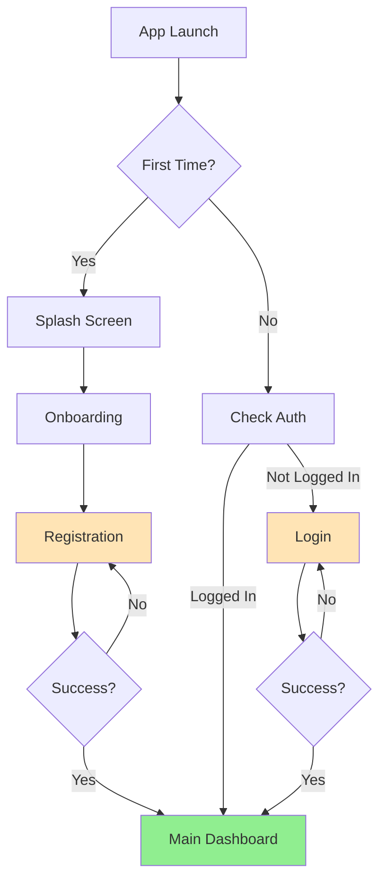

**Description**:
1. User downloads and opens app
2. Sees splash screen (2 seconds max)
3. If first time → Onboarding (3 screens)
4. User creates account → Registration flow
5. On success → Main Dashboard
6. If returning user → Auto-login or Login screen

**Duration**: 2-5 minutes for new user

---

### 2.2 Returning User Journey

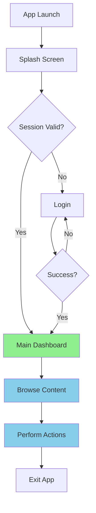

**Description**:
1. User opens app
2. Auto-login with saved session
3. Lands on Main Dashboard
4. Performs daily tasks
5. Exits app (state saved)

**Duration**: < 10 seconds to dashboard

---

## 3. Authentication Flows

### 3.1 Registration Flow

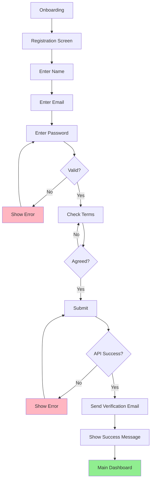

**Steps**:
1. User fills registration form
2. Real-time validation on each field
3. Password strength indicator updates
4. Terms checkbox required
5. Submit button enabled when valid
6. API call to create account
7. Success → Verification email sent
8. User redirected to Main Dashboard

**Error Handling**:
- Invalid email → "Please enter a valid email"
- Weak password → "Password must be stronger"
- Email exists → "Account already exists. Login?"
- Network error → "Connection failed. Retry?"
- Server error → "Something went wrong. Try again."

**Duration**: 1-2 minutes

---

### 3.2 Login Flow

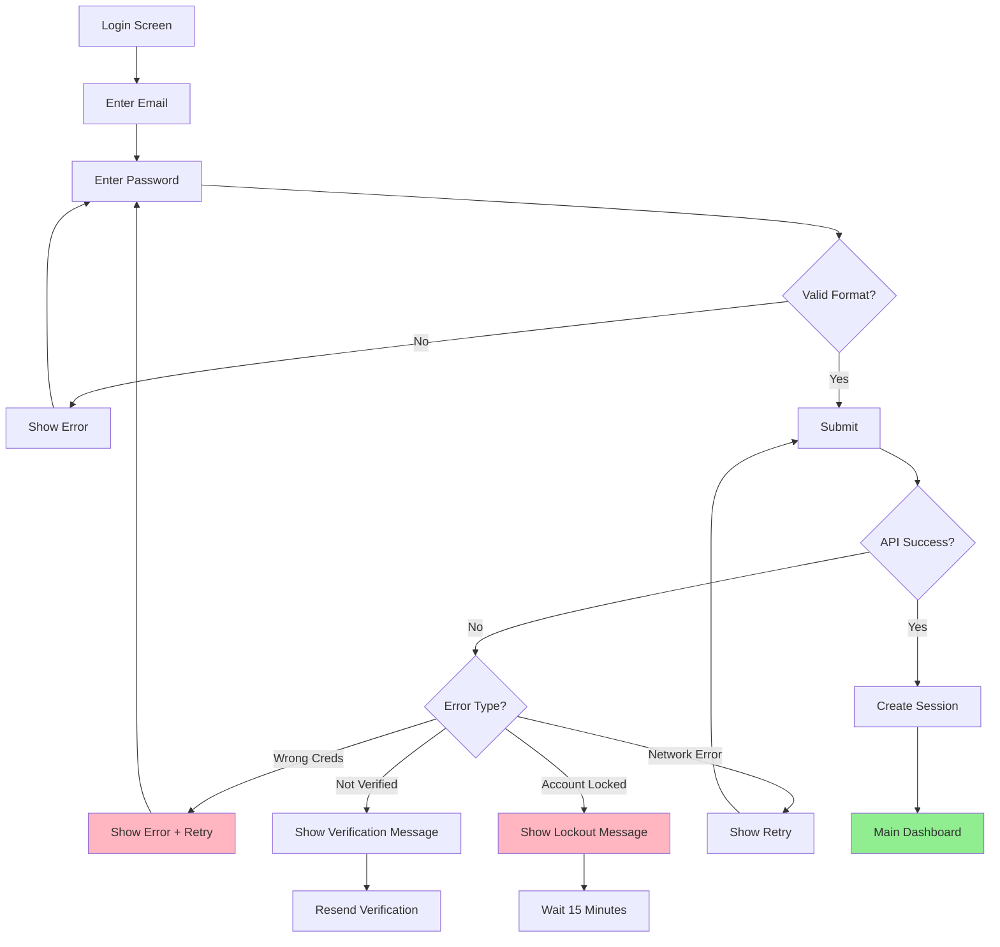

**Steps**:
1. User enters credentials
2. Real-time format validation
3. Submit to API
4. Handle various error scenarios
5. Success → Create session token
6. Redirect to Main Dashboard

**Error Scenarios**:
- Wrong password (< 3 attempts) → Show error, allow retry
- Wrong password (3 attempts) → Lock account for 15 minutes
- Account not verified → Show message, offer resend
- Network error → Show retry button

**Duration**: 10-30 seconds

---

### 3.3 Forgot Password Flow

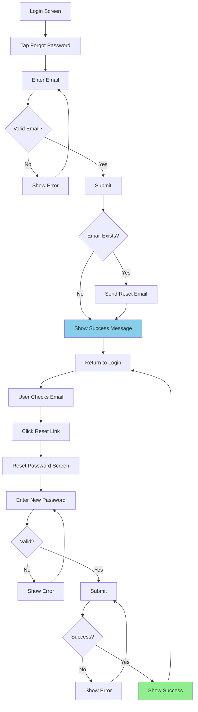

**Steps**:
1. User taps "Forgot Password"
2. Enters email address
3. System sends reset link (if email exists)
4. Shows generic success message (security)
5. User clicks link in email
6. Opens reset password screen
7. Enters new password
8. Success → Returns to login

**Security Notes**:
- Always show success message (don't reveal if email exists)
- Reset link expires in 1 hour
- Link is single-use only

**Duration**: 2-5 minutes

---

## 4. Main Feature Flows

### 4.1 Main Dashboard Flow

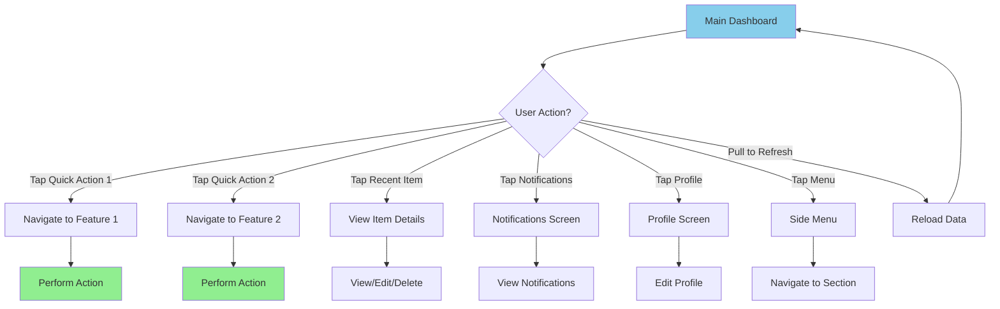

**Interactions**:
- **Quick Actions**: Tap to navigate to feature screens
- **Recent Activity**: Tap to view details, swipe to delete/archive
- **Notifications**: Badge shows unread count
- **Profile**: Access settings and account
- **Menu**: Access all app sections
- **Pull to Refresh**: Reload dashboard data

---

### 4.2 [Core Feature] Flow

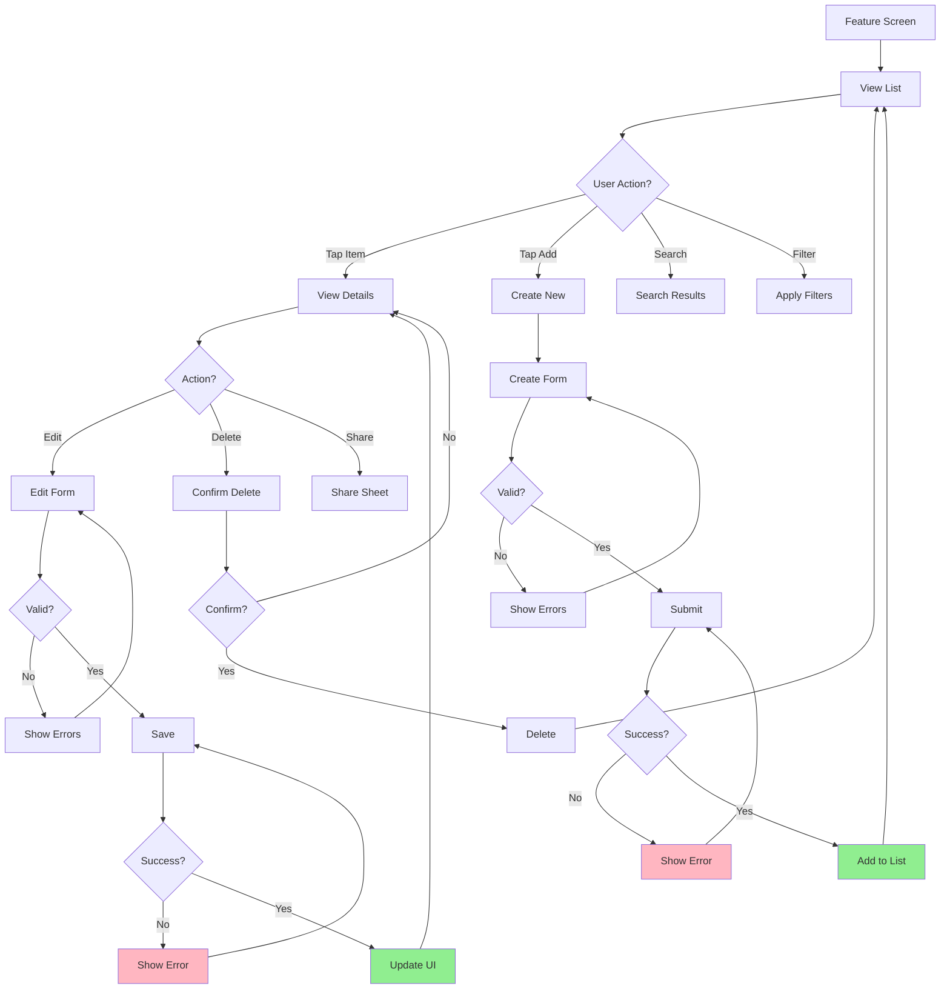

**Steps**:
1. User views list of items
2. Can search, filter, or sort
3. Tap item to view details
4. Can edit, delete, or share
5. Edit → Validate → Save → Update UI
6. Delete → Confirm → Remove from list
7. Add new → Fill form → Validate → Submit → Add to list

**Error Handling**:
- Validation errors → Show inline messages
- Network errors → Show retry option
- Server errors → Show generic error message

---

## 5. Navigation Patterns

### 5.1 Tab Bar Navigation

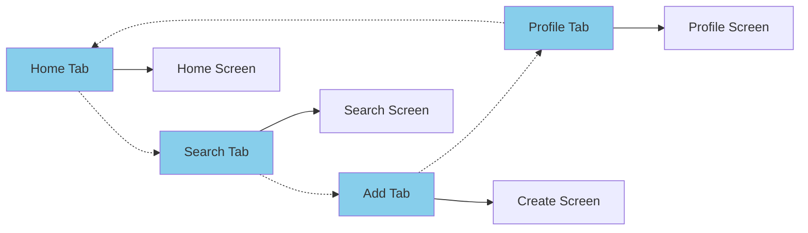

**Behavior**:
- Tap tab to switch screens
- Selected tab highlighted
- Each tab maintains its own navigation stack
- Switching tabs preserves state

---

### 5.2 Modal Presentation

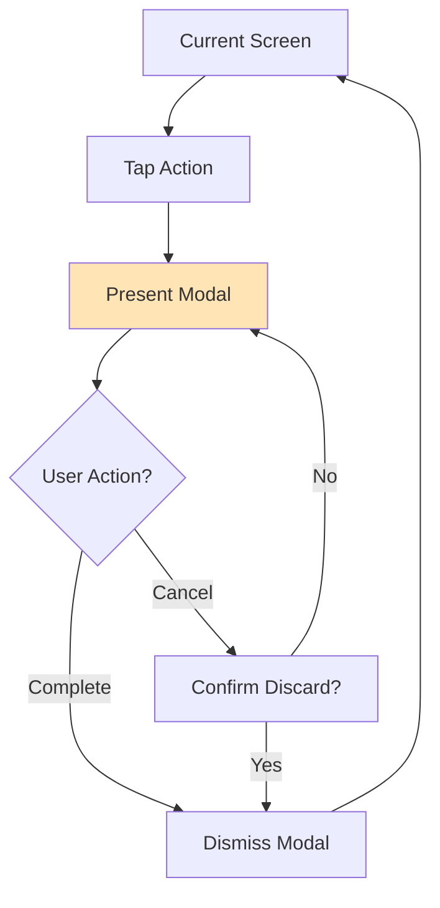

**Usage**:
- Create/Edit forms
- Settings screens
- Confirmation dialogs
- Full-screen overlays

**Dismissal**:
- Swipe down to dismiss
- Tap Cancel/Done button
- Confirm if unsaved changes

---

### 5.3 Navigation Stack

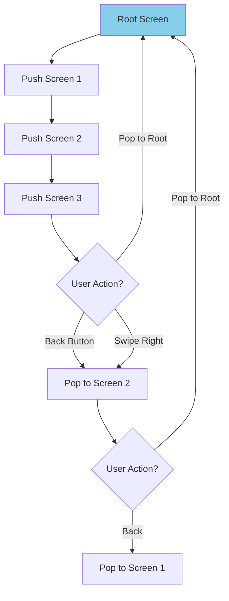

**Behavior**:
- Push screens onto stack
- Back button pops current screen
- Swipe from left edge to go back
- Can pop to root screen

---

## 6. Error Handling Flows

### 6.1 Network Error Flow

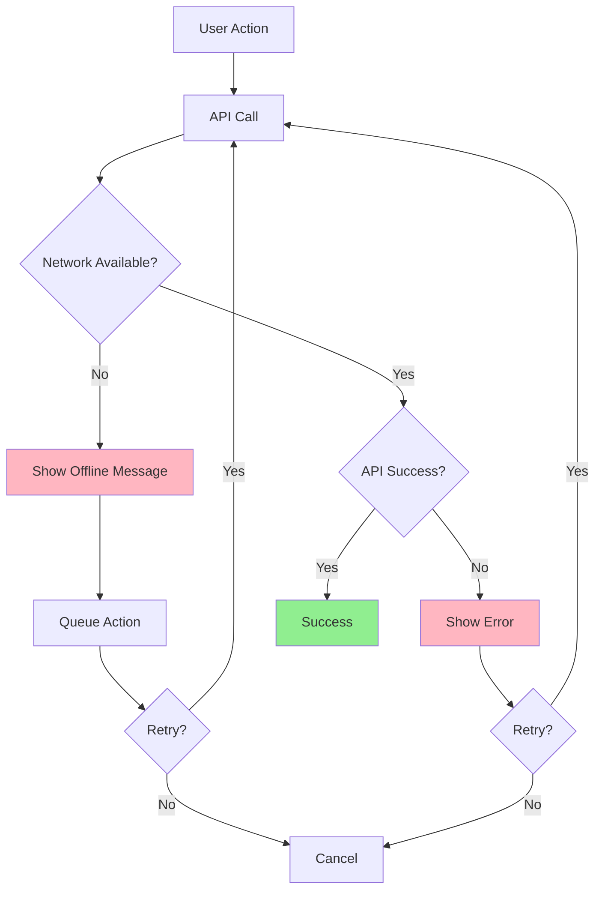

**Handling**:
- Detect network status
- Show clear error messages
- Offer retry option
- Queue actions for later (if applicable)
- Auto-retry when connection restored

---

### 6.2 Validation Error Flow

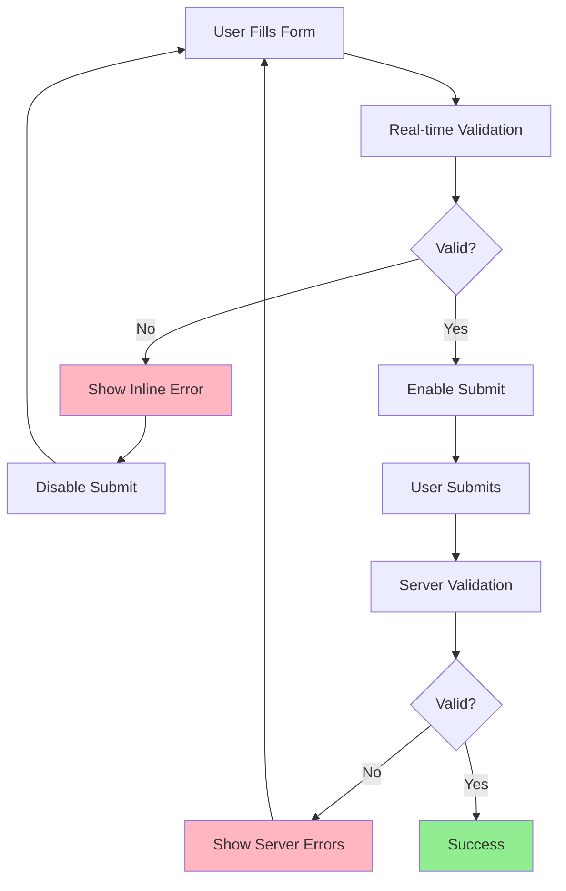

**Validation Levels**:
1. **Client-side**: Real-time, instant feedback
2. **Server-side**: Final validation, business rules
3. **Error Display**: Inline, field-specific messages

---

## 7. Loading States

### 7.1 Initial Load

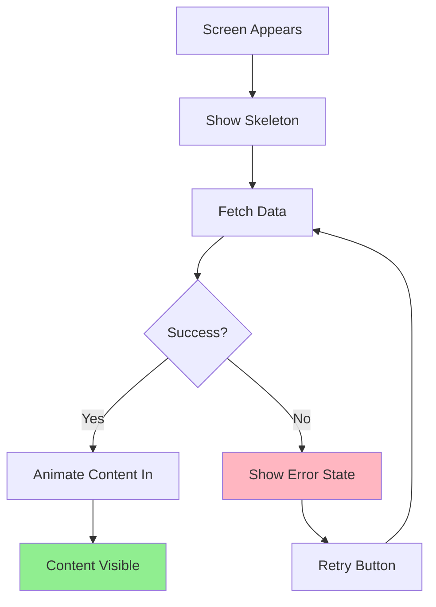

**States**:
- **Skeleton**: Placeholder UI while loading
- **Loading**: Activity indicator for quick loads
- **Content**: Fade in when ready
- **Error**: Clear message with retry

---

### 7.2 Pull to Refresh

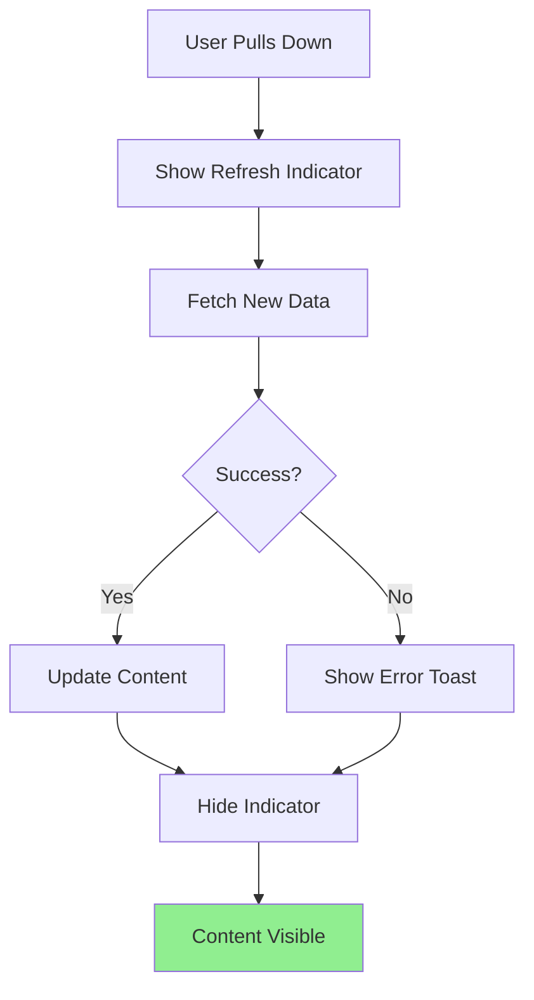

---

## 8. Offline Support

### 8.1 Offline Mode Flow

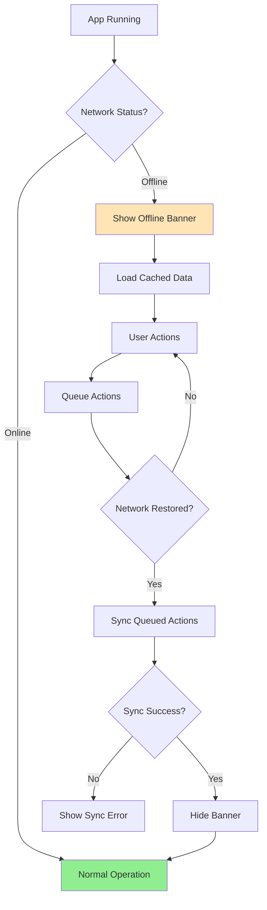

**Behavior**:
- Detect network changes
- Show persistent offline banner
- Load cached data
- Queue write actions
- Auto-sync when online
- Show sync status

---

## 9. Accessibility Flows

### 9.1 VoiceOver Navigation

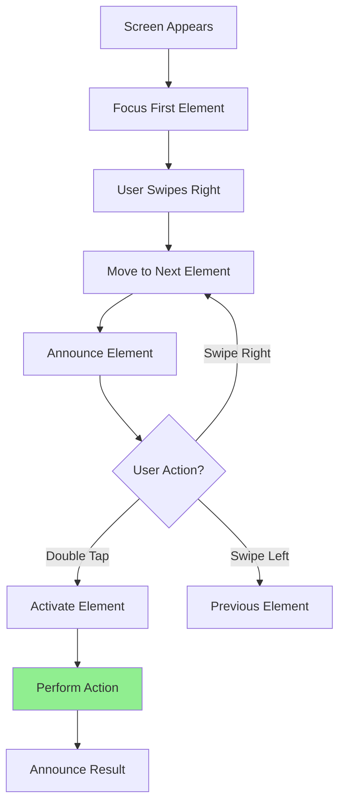

**Requirements**:
- All elements have accessibility labels
- Logical reading order
- Custom actions for complex gestures
- Announcements for state changes

---

## 10. Onboarding & Tutorials

### 10.1 First-Time User Experience

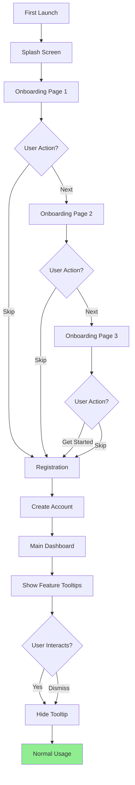

**Onboarding Goals**:
1. Explain core value proposition
2. Show key features (3 screens max)
3. Quick registration process
4. Contextual tooltips on first use
5. Progressive disclosure of features

---

## 11. Performance Considerations

### 11.1 Optimistic UI Updates

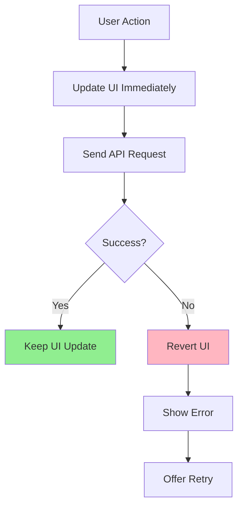

**Benefits**:
- Instant feedback
- Perceived performance
- Better user experience

**Use Cases**:
- Like/favorite actions
- Simple updates
- Non-critical operations

---

## 12. Flow Summary

### 12.1 Critical Paths

| Flow | Screens | Duration | Priority |
|------|---------|----------|----------|
| New User Registration | 4 | 2-5 min | High |
| Returning User Login | 2 | 10-30 sec | High |
| Main Feature Usage | 3-5 | 1-3 min | High |
| Settings Update | 2-3 | 30-60 sec | Medium |

### 12.2 Success Metrics

| Metric | Target | Measurement |
|--------|--------|-------------|
| Registration Completion | > 70% | Users who complete signup |
| Login Success Rate | > 95% | Successful logins / attempts |
| Feature Discovery | > 60% | Users who use main features |
| Task Completion | > 80% | Successful task completions |

---

## 13. Future Enhancements

### 13.1 Planned Flows
- Social login (Apple, Google)
- Biometric authentication
- Multi-step wizards
- Advanced search filters
- Batch operations

### 13.2 Optimization Opportunities
- Reduce registration steps
- Improve error recovery
- Add more offline capabilities
- Enhance loading states

---

**Document Version**: 1.0  
**Last Updated**: [Date]  
**Status**: Draft / In Review / Approved  
**Dependencies**: Project_Overview.md, Use_Cases.md, Functional_Requirements.md, Wireframes.md
```

### Step 3: ASK USER CONFIRMATION (REQUIRED)

After creating `UX_Flows.md`, MUST display:

```
✅ Created: {{IDE_CONFIG_DIR}}specs/[project-name]/UX_Flows.md

📋 Summary:
- User Journeys: X
- Feature Flows: Y
- Error Handling Flows: Z
- Total Mermaid Diagrams: W

🎉 All specification documents completed!

📚 Document Set:
1. ✅ Project_Overview.md
2. ✅ Use_Cases.md
3. ✅ Functional_Requirements.md
4. ✅ Wireframes.md
5. ✅ UX_Flows.md

🔍 Please review the UX_Flows.md file

❓ What would you like to do next?
1. ✅ Start implementation (create requirements.md for first feature)
2. ✏️ Request modifications to any document
3. 📊 Generate traceability matrix
4. ⏸️ Stop here, continue later
```

**This is the FINAL document in the spec chain!**

---

## Rules

### Content Quality
- Use Mermaid syntax for all diagrams
- Include both happy paths and error scenarios
- Document all decision points
- Show loading and error states

### Mermaid Diagrams
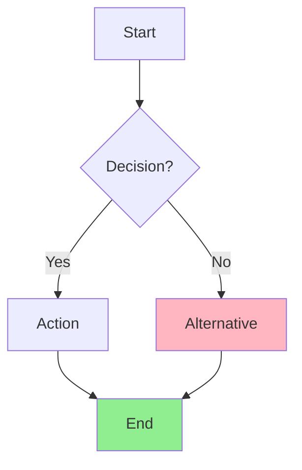

**Colors**:
- Green (#90EE90): Success states
- Red (#FFB6C1): Error states
- Blue (#87CEEB): Normal states
- Yellow (#FFE4B5): Warning/Info states

### Flow Documentation
- Start with high-level journeys
- Break down into detailed flows
- Include timing estimates
- Document all error paths
- Show loading states
- Consider offline scenarios

### User Interaction
- ALWAYS read all previous documents
- WAIT for user confirmation
- This is the FINAL document
- If user selects modify → apply changes → ask again
- If user wants to start implementation → suggest next steps

### Exit Checklist (Efficiency)
- No placeholder tokens like `[Core Feature]`, `[Screen Title]` in final file
- Every P0 screen (`WF-XXX`) appears in at least one flow
- Every critical error scenario has a recovery path
- Mermaid syntax is valid and consistent

### Delivery Summary (Required)
At the end, include concise summary bullets:
- Created file path
- Total diagrams
- WF coverage: mapped screens / total screens
- Open assumptions count

---

## Tips for AI

- Base flows on wireframes and use cases
- Think about complete user journeys
- Include realistic error scenarios
- Consider network issues and offline mode
- Show loading states and transitions
- Think about accessibility (VoiceOver navigation)
- Document optimistic UI updates
- Include performance considerations
- Use consistent Mermaid syntax
- Color-code states for clarity

---

## Next Steps After Completion

Once all 5 documents are created and approved:

1. **Traceability Matrix**: Generate matrix linking all documents
2. **Implementation Planning**: Break down into sprints/phases
3. **Feature Development**: Start with requirements.md for first feature
4. **Design Handoff**: Share with designers for high-fidelity mockups
5. **Development**: Begin coding with complete specifications
