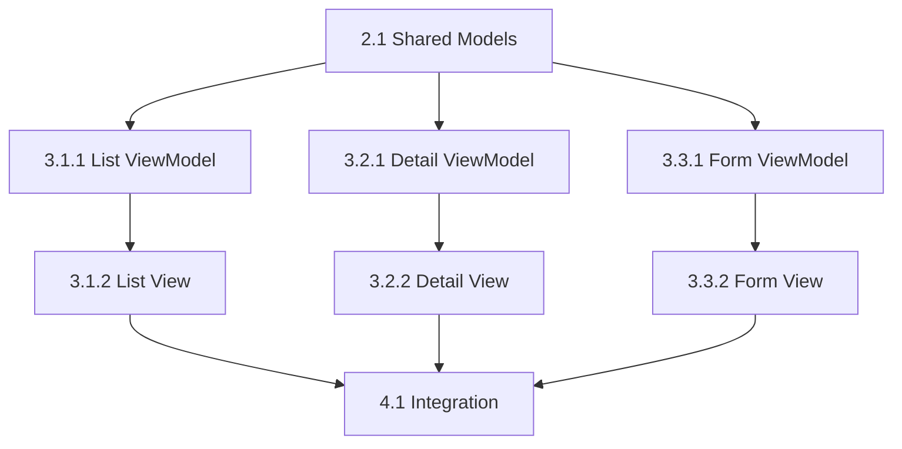

# Parallel Task Execution Guide

## Overview

By default, tasks are executed **sequentially** (3.1 → 3.2 → 3.3).

With parallel execution, independent tasks can run **simultaneously** to reduce total time.

---

## When to Use Parallel Execution

### ✅ Safe for Parallel

- Tasks in different features (3.1.x and 3.2.x)
- Tasks with no shared files
- Tasks with no data dependencies
- ViewModel tasks across features
- View tasks across features (after ViewModels done)

### ❌ Must Stay Sequential

- Tasks in same feature (3.1.1 before 3.1.2)
- Tasks sharing same files
- Tasks with data dependencies
- Integration tasks (must be last)

---

## Dependency Graph

### Example: Todo List Feature



**Parallel Groups**:
- **Group 1**: 2.1 (Shared) - Sequential
- **Group 2**: 3.1.1, 3.2.1, 3.3.1 (ViewModels) - **Parallel**
- **Group 3**: 3.1.2, 3.2.2, 3.3.2 (Views) - **Parallel**
- **Group 4**: 4.1 (Integration) - Sequential

**Time Savings**:
```
Sequential: 2.1 (4h) + 3.1.1 (4h) + 3.2.1 (4h) + 3.3.1 (4h) + ... = 32h
Parallel:   2.1 (4h) + max(3.1.1, 3.2.1, 3.3.1) (4h) + ... = 16h
Savings:    50% faster!
```

---

## Usage

### Command Format

```bash
# Sequential (default)
execute-tasks 3.1.1.1

# Parallel execution
execute-tasks --parallel 3.1.1.1,3.2.1.1,3.3.1.1
```

### In Agent Prompt

```
You: "Implement tasks 3.1.1.1, 3.2.1.1, 3.3.1.1 in parallel"

Claude:
- Validates dependencies
- Checks for conflicts
- Executes in parallel if safe
- Reports results
```

---

## Conflict Detection

Before parallel execution, the system checks:

### 1. File Conflicts

```python
def check_file_conflicts(tasks):
    files_by_task = {}
    for task in tasks:
        files_by_task[task] = get_files_for_task(task)
    
    # Check for overlapping files
    for t1, t2 in combinations(tasks, 2):
        if files_by_task[t1] & files_by_task[t2]:
            return f"Conflict: {t1} and {t2} modify same files"
    
    return None
```

**Example**:
```
Task 3.1.1.1: Creates Features/Todo/ViewModels/ListViewModel.swift
Task 3.2.1.1: Creates Features/Todo/ViewModels/DetailViewModel.swift
→ No conflict (different files)

Task 3.1.1.1: Creates Features/Todo/Models/Todo.swift
Task 3.2.1.1: Modifies Features/Todo/Models/Todo.swift
→ CONFLICT! Must run sequential
```

### 2. Data Dependencies

```python
def check_data_dependencies(tasks):
    for task in tasks:
        dependencies = get_dependencies(task)
        for dep in dependencies:
            if dep in tasks:
                return f"Conflict: {task} depends on {dep}"
    
    return None
```

**Example**:
```
Task 3.1.2.1 (List View) depends on 3.1.1.1 (List ViewModel)
→ CONFLICT! Must run sequential
```

### 3. Resource Conflicts

```python
def check_resource_conflicts(tasks):
    resources_by_task = {}
    for task in tasks:
        resources_by_task[task] = get_resources(task)
    
    # Check for shared resources
    for t1, t2 in combinations(tasks, 2):
        if resources_by_task[t1] & resources_by_task[t2]:
            return f"Conflict: {t1} and {t2} use same resources"
    
    return None
```

**Example**:
```
Task 3.1.1.1: Uses TodoService
Task 3.2.1.1: Uses TodoService (read-only)
→ No conflict (both read-only)

Task 3.1.1.1: Modifies TodoService
Task 3.2.1.1: Modifies TodoService
→ CONFLICT! Must run sequential
```

---

## Parallel Execution Rules

### Rule 1: Same Feature = Sequential

```markdown
❌ Cannot parallel:
- 3.1.1.1 (List ViewModel)
- 3.1.2.1 (List View)

Reason: Same feature, View depends on ViewModel
```

### Rule 2: Different Features = Parallel (if no conflicts)

```markdown
✅ Can parallel:
- 3.1.1.1 (List ViewModel)
- 3.2.1.1 (Detail ViewModel)
- 3.3.1.1 (Form ViewModel)

Reason: Different features, no shared files
```

### Rule 3: Shared Tasks = Sequential

```markdown
❌ Cannot parallel:
- 2.1.1 (Create Todo model)
- 2.1.2 (Create TodoResponse model)

Reason: Both in Shared section, may have dependencies
```

### Rule 4: Integration = Last

```markdown
❌ Cannot parallel:
- 3.1.2.1 (List View)
- 4.1 (Wire navigation)

Reason: Integration requires all features complete
```

---

## Implementation in tasks.md

### Add Parallel Groups Section

```markdown
## Parallel Execution Plan

### Group 1: Shared (Sequential)
- 2.1.1 Create Todo model
- 2.1.2 Create TodoResponse model
- 2.2.1 Create TodoService

**Checkpoint 2**: ⬜ Shared complete

### Group 2: ViewModels (Parallel)
- 3.1.1.1 List ViewModel
- 3.2.1.1 Detail ViewModel
- 3.3.1.1 Form ViewModel

**Checkpoint 3.x.1**: ⬜ All ViewModels complete

### Group 3: Views (Parallel)
- 3.1.2.1 List View
- 3.2.2.1 Detail View
- 3.3.2.1 Form View

**Checkpoint 3.x.2**: ⬜ All Views complete

### Group 4: Integration (Sequential)
- 4.1 Wire navigation List → Detail
- 4.2 Wire navigation List → Form
- 4.3 Wire navigation Detail → Form

**Checkpoint 4**: ⬜ Integration complete
```

### Add Dependency Matrix

```markdown
## Task Dependencies

| Task | Depends On | Can Parallel With |
|------|------------|-------------------|
| 2.1.1 | - | - |
| 2.1.2 | 2.1.1 | - |
| 3.1.1.1 | 2.1.1 | 3.2.1.1, 3.3.1.1 |
| 3.2.1.1 | 2.1.1 | 3.1.1.1, 3.3.1.1 |
| 3.3.1.1 | 2.1.1 | 3.1.1.1, 3.2.1.1 |
| 3.1.2.1 | 3.1.1.1 | 3.2.2.1, 3.3.2.1 |
| 3.2.2.1 | 3.2.1.1 | 3.1.2.1, 3.3.2.1 |
| 3.3.2.1 | 3.3.1.1 | 3.1.2.1, 3.2.2.1 |
| 4.1 | 3.1.2.1, 3.2.2.1 | - |
```

---

## Checkpoint Behavior with Parallel

### Sequential Checkpoints

```markdown
**Checkpoint 2.1**: ⬜ Models complete
**Checkpoint 2.2**: ⬜ Services complete
**Checkpoint 2**: ⬜ Shared complete
```

Each checkpoint waits for previous.

### Parallel Checkpoints

```markdown
**Checkpoint 3.1.1**: ⬜ List ViewModel complete
**Checkpoint 3.2.1**: ⬜ Detail ViewModel complete
**Checkpoint 3.3.1**: ⬜ Form ViewModel complete

**Checkpoint 3.x.1**: ⬜ ALL ViewModels complete (gate)
```

Gate checkpoint waits for ALL parallel tasks.

---

## Error Handling in Parallel

### If One Task Fails

```
Parallel execution:
- Task 3.1.1.1: ✅ Success
- Task 3.2.1.1: ❌ Build error
- Task 3.3.1.1: ✅ Success

Action:
1. Stop all parallel tasks
2. Report which task failed
3. Fix the failed task
4. Resume parallel execution
```

### Retry Strategy

```
Attempt 1: Parallel execution
→ Task 3.2.1.1 fails

Attempt 2: Fix 3.2.1.1, retry parallel
→ Task 3.2.1.1 fails again

Attempt 3: Switch to sequential
→ Execute 3.2.1.1 alone with full debugging
```

---

## Best Practices

### 1. Start with Sequential

For first-time features, use sequential to understand dependencies.

### 2. Profile Before Parallel

```bash
# Time sequential execution
time execute-tasks 3.1.1.1
time execute-tasks 3.2.1.1

# If both take similar time → good candidate for parallel
```

### 3. Group by Type

```
Group ViewModels together
Group Views together
Group Services together
```

### 4. Limit Parallel Count

```
Max 3-4 tasks in parallel
Too many → harder to debug
```

### 5. Monitor Build Times

```
Parallel build may stress system
Watch CPU/memory usage
```

---

## Example: Full Feature Parallel Execution

```bash
# Phase 1: Shared (Sequential)
execute-tasks 2.1.1  # 30min
execute-tasks 2.1.2  # 30min
execute-tasks 2.2.1  # 1h
# Total: 2h

# Phase 2: ViewModels (Parallel)
execute-tasks --parallel 3.1.1.1,3.2.1.1,3.3.1.1  # max(1h, 1h, 1h) = 1h
# Total: 1h (vs 3h sequential)

# Phase 3: Views (Parallel)
execute-tasks --parallel 3.1.2.1,3.2.2.1,3.3.2.1  # max(1h, 1h, 1h) = 1h
# Total: 1h (vs 3h sequential)

# Phase 4: Integration (Sequential)
execute-tasks 4.1  # 30min
execute-tasks 4.2  # 30min
# Total: 1h

# Grand Total: 5h (vs 9h sequential)
# Savings: 44% faster!
```

---

## Limitations

### Current Limitations

1. **No automatic dependency detection**: Must manually specify
2. **No automatic conflict resolution**: Must fix manually
3. **No rollback**: If parallel fails, must fix and retry
4. **No progress tracking**: Can't see individual task progress

### Future Enhancements

1. Auto-detect dependencies from file analysis
2. Auto-resolve conflicts by reordering
3. Rollback failed parallel execution
4. Real-time progress dashboard

---

*Last updated: February 2026*
*Status: Experimental*
